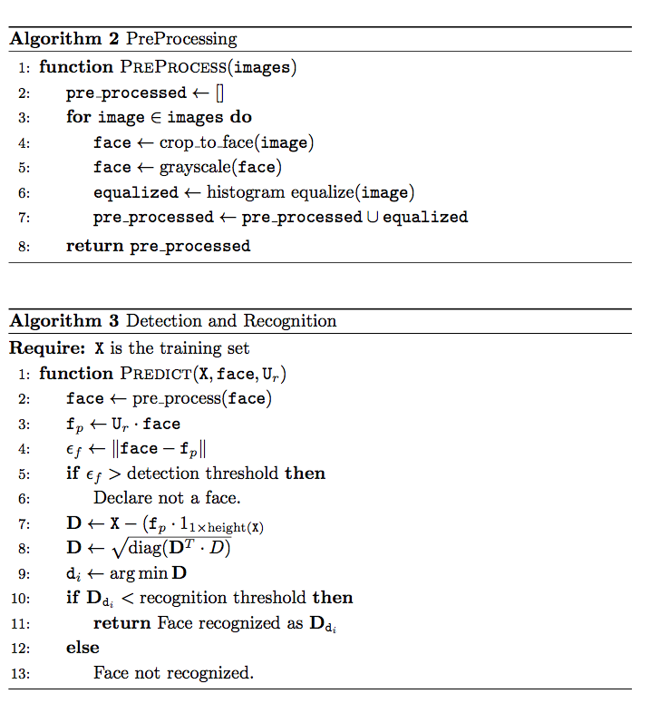

Quick Start 
---------------------------

Download Yalefaces Dataset: http://vision.ucsd.edu/content/yale-face-database

Run organize_faces.sh to organize faces into subfolders 

Introduction
============

This project applies “singular value decomposition” (SVD) and Principal
Component Analysis from Linear Algebra to digital signal processing to
produce a soft real-time image recognition system.

The make of a digital image
---------------------------

To begin, an intuitive view of what constitutes an image in digital
format: In its simplest form, a 2D image can be represented as a
2-dimensional array or matrix of dimensions *wh* where the image has
width *w* and height *h*. The elements of the array (“pixels” in
computer science jargon) represent the smallest “constituent” of the
representation of the image and individually encode the hue, luminosity,
and saturation of a small portion of what a “real” view of the object of
the image would look like in reality.

In practice, the common encoding for color images (still raw, however,
without any compression) uses mixes of the colors Red, Green and Blue
wherein the value “0” represents total absence of the color and some
maximum value represents the highest vibrance the encoding system can
afford the color. In this way the representation is describable as a
2-ary function *I : D_w x D_h -> R$ where *I(x_i, y_j)=r_ij* for
*D_w, D_h* being the ranges of the dimensions of the image, assumed
henceforth to refer to width and height, respectively, and *R* the
vector space of the representation for every individual pixel.

**Example:** for a grayscale (one color, gray) image of dimensions
60cm x 40cm, a resolution of 72px/cm^2 and a pixel representation of a number on the discrete range {0, ..255},
the function corresponding to the image would be defined as *I* : {1, ..60 x 72} x {1, ..40x72\} -> {0, ..255}.

Concepts
========

Eigenspaces
-----------

A quick mathematical refresher:
The eigenspace of an matrix *mxm* **A** is the subspace of C (**A**) (the column space of **A** spanning the subspace of R^n which is invariant under **A** as a linear transformation.

We consider Singular Value Decomposition when applied to real-valued
*m x n* matrices (we try to deal as much as we can with only square
matrices to make things uniform for our algorithm). This gives us an
orthornormal basis for the column space of the covariance matrix of our
data matrix **A***(m x n)* (where **A'** = **A** - mean(**A**)) in the form of **U** in

This is the basis for PCA.

PCA and Dimensionality Reduction
--------------------------------

PCA (“Principal Component Analysis”) aims to find the *best representation* basis for a given data set that best describes the variance in the dataset. It is primarily a rotation of the original coordinates.

By finding this best representation on the given ‘training’ dataset, we
can define a new subset of our eigenspace that best recognizes what the
data primarily represents (in this case, faces). The earliest
coordinates would come to represent the most important ‘features’
observed in the original data. (See Figures 2, 3.)
We’ll call this representation projection space the *Face Space*, given that it best represents faces. (See Figure 5.)

Eigen Faces
===========

Setup and Preprocessing
-----------------------

Images are uniformly converted to grayscale.

Images are analyzed by computer vision techniques to determine the most
likely location for faces. Candidates are delineated and the bounding
boxes are used by the next phases of the algorithm. (See Algorithm 2.)

They’re centered (mean subtracted, Figure 4) as part of PCA and then projected to the Face Space.

The same is done for all new test images that the model has not witnessed within the training set.

Theory
------

The PCA’ed representation of faces from both the training set and the testing set (any images from the real world not witnessed by the model) would be theoretically ‘close together’ on the Face Space by virtue of their statistic properties (as objects of the same: faces).

The distance between the original image and its face projection tells us
whether we can consider the image to actually be a face.

We can then compare the distance to the projections of each of our training faces and can thus recognize the subject in the image. Beyond a certain threshold, it is classifed as an unknown face.

Algorithms
----------

Conclusion
==========

It works.

Appendix A
==========

<table>
  <tr><td align="center"></td></tr>
  <tr><td align="center"></td></tr>
  <tr><td align="center"></td></tr>
  <tr><td align="center"></td></tr>
</table>

